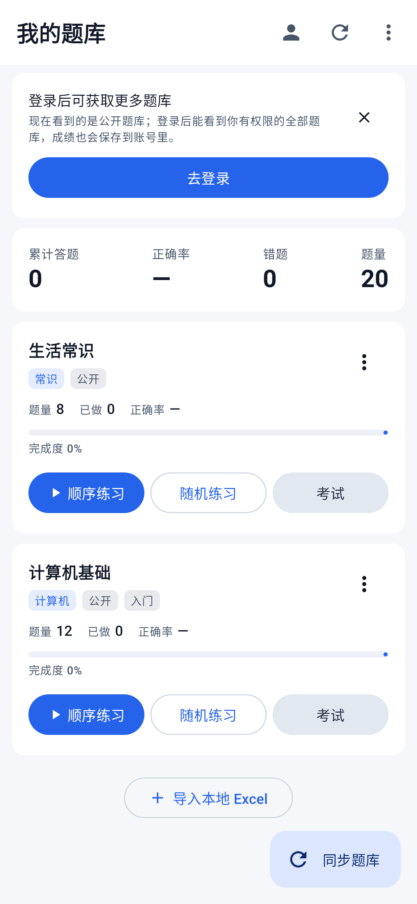
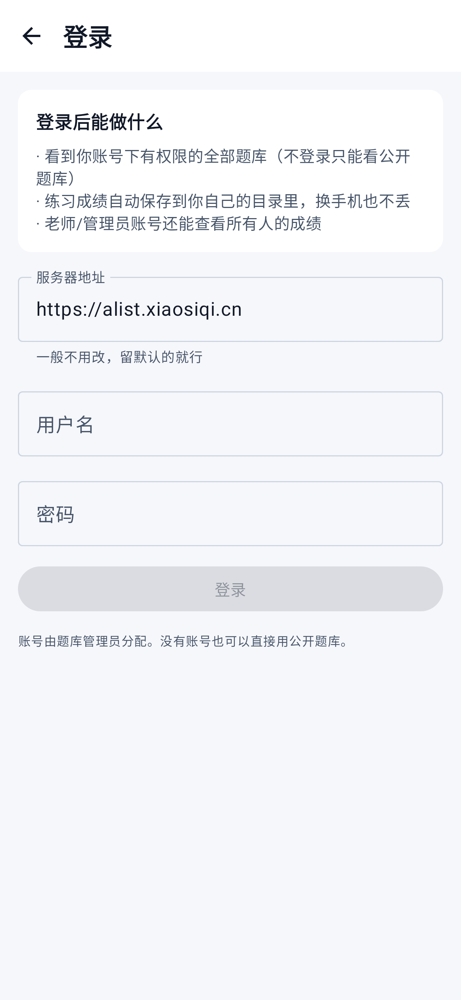
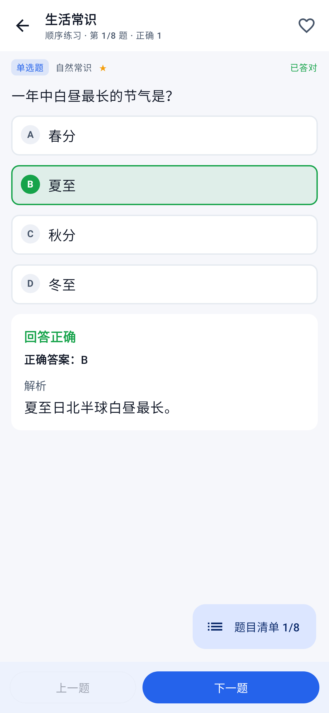
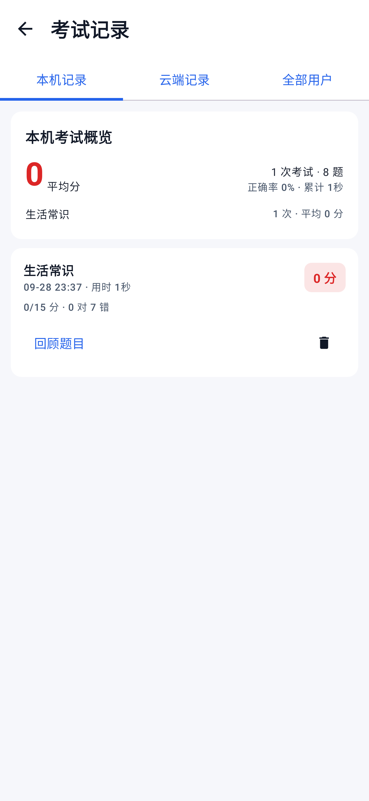
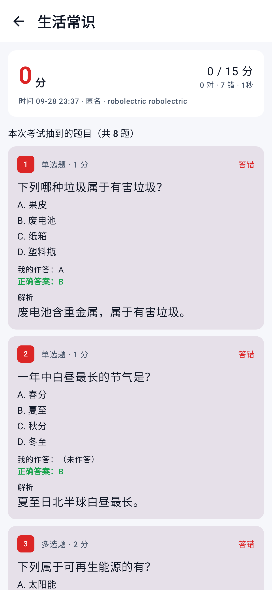

# 题库 App

一个**纯客户端**的安卓题库应用：题库列表与题库文件都放在你自己的 [alist](https://alistgo.com/) 上，
App 负责下载、解析、练习、考试、判分、统计，并把**考试**成绩按 alist 的权限体系写回去。

**没有服务端**。用户体系、目录权限、文件读写全部复用 alist，所以部署成本就是「你已经有的那个 alist」。

---

## 功能

| 模块 | 说明 |
|---|---|
| 题库列表 | 从 alist 读取一张「题库列表 Excel」，里面每行指向一个题库文件 |
| 题库下载 | 单个下载 / 全部下载；重新下载时**自动保留**收藏、错题与答题记录（按题干匹配） |
| Excel 解析 | 自研零依赖解析器，容错表头别名、列顺序、全角半角、GBK 编码的 CSV |
| 题型 | 单选 / 多选 / 判断 / 填空 / 简答，题型可写在表里，也可自动推断 |
| 图片 | 题干、选项、解析里都能放图片（Markdown / HTML / 裸链接），自动缓存到本地，**离线也能看图** |
| 练习 | 顺序 / 随机 / 错题 / 收藏；**左右滑动切题**；打乱选项；右下角题目清单（答题卡）跳题；进度自动保存；**只记错题，不产生成绩** |
| 考试模式 | 按题型分值自动组卷（题库列表 Excel 可配）、**左右滑动切题**、不即时判分、交卷统一判分、百分制成绩、主观题自评 |
| 考试记录 | 每次考试抽到的题**带快照保存**，题库更新后仍可原样回顾；本机 / 云端 / 全部用户三个视角 |
| 成绩上传 | **只上传考试模式的成绩**，一次考试一个 JSON，管理员可看到所有人的考试记录 |
| 错题与收藏 | 错题本、收藏夹、答对自动移出错题（可关） |
| 统计 | 总览、最近 14 天柱状图、按题库的正确率与完成度 |
| 成绩 | 每次练习生成成绩，可上传到 alist；支持查看云端成绩 |
| 管理员视图 | 用 alist 管理员账号登录后，可直接查看**所有用户**的成绩与逐题答题记录 |
| 免登录 | 不填账号也能用，只能看到 alist 上公开的题库 |
| 本地导入 | 支持从手机里直接选 Excel 导入，不需要 alist |

---

## 界面

下面几张是在真实渲染环境下、连真实 alist 截的图（见 `docs/截图/`）：

| 首次启动：自动加载线上题库 | 登录页（只有三个字段） |
|---|---|
|  |  |

| 练习 | 答对后显示解析 |
|---|---|
|  |  |

| 考试模式（不即时判分） | 考试成绩单 |
|---|---|
|  |  |

| 考试记录 | 回顾每次考试抽到的题 |
|---|---|
|  |  |

---

## 快速开始（普通用户零配置）

1. 安装 APK，**打开就能用**：第一次启动会自动获取并下载好公开题库，几秒钟后首页就有题库卡片，
   直接点「顺序练习」即可。
2. 如果当时没网、或在线题库临时打不开，会自动载入一份内置示例题库兜底，保证能直接练。
3. 想看更多题库：首页点「登录获取更多题库」→ 登录页只有**服务器地址（已预填）/ 用户名 / 密码**三个框。

服务端（alist 上的题库与权限）怎么配，见 [docs/alist部署说明.md](docs/alist部署说明.md)；
Excel 怎么写，见 [docs/Excel格式规范.md](docs/Excel格式规范.md)；面向使用者的说明见 [docs/使用说明.md](docs/使用说明.md)。

项目已在一套真实的 alist/OpenList 上完成端到端联调（匿名只读公开题库、普通用户读内部题库、
只能写自己的成绩目录、改不了题库），配置方式与踩坑记录见
[docs/alist部署说明.md](docs/alist部署说明.md)。

---

## 关于权限（为什么不需要后端）

App 全程使用你自己的 alist 账号去调 alist 的 API，权限判断完全由 alist 服务端完成：

- **匿名**：只能读 alist 上公开的路径。
- **普通用户**：只能读自己被授权的路径（例如只给了 `/题库` 和 `/成绩/张三`）。
- **管理员**：能列出 `/成绩` 下所有用户的目录，所以 App 里能直接看到每个人的成绩和逐题答题记录。

App 端不做任何额外鉴权，也不缓存别人的数据——你点一次「全部用户」才会去读一次。

---

## 成绩是怎么存的

每次练习结束写一个独立 JSON 文件，路径形如：

```
<成绩目录>/<用户名>/20260928_193000_张三_计算机网络基础.json
```

一次练习一个文件（而不是往一个总表里追加），多台设备同时上传也不会互相覆盖，汇总在客户端做。
文件内容包含题库、模式、用时、正确率，以及（可选的）每一题的作答与对错：

```json
{
  "schema": 1,
  "app": "QuizBank",
  "user": "张三",
  "bankName": "计算机网络基础",
  "bankKey": "1001",
  "mode": "RANDOM",
  "total": 50, "answered": 50, "correct": 42, "wrong": 8,
  "accuracy": 0.84, "score": 84.0,
  "durationSec": 1234,
  "startedAt": 1759000000000, "finishedAt": 1759001234000,
  "device": "Xiaomi 14",
  "details": [ { "index": 1, "correct": true, "my": "A", "answer": "A" } ]
}
```

不需要逐题明细的可以在「设置 → 成绩」里关掉「上传答题明细」，文件会小很多。

---

## Excel 格式

### 题库列表（目录表）

| 题库ID | 题库名称 | 分类 | 描述 | 文件地址 | 题目数量 | 版本 | 标签 |
|---|---|---|---|---|---|---|---|
| 1001 | 计算机网络基础 | 计算机 | 期末复习 | /题库/计算机网络基础.xlsx | 120 | 2024版 | 期末,专升本 |

必需列只有**题库名称**和**文件地址**，其余可缺，列顺序随意，多几列无关内容也没关系。
表头别名（`名称/题库/标题`、`地址/路径/链接/文件/url` 等）都能识别。

「文件地址」支持三种写法，App 会自动换算：

- alist 路径：`/题库/网络.xlsx`
- alist 直链：`https://域名/d/题库/网络.xlsx`
- 浏览器地址栏里的链接：`https://域名/题库/网络.xlsx`（会被自动转成 alist 路径）

### 题库文件

| 题号 | 题型 | 题干 | 选项A | 选项B | 选项C | 选项D | 答案 | 解析 | 难度 | 章节 | 标签 | 分值 |
|---|---|---|---|---|---|---|---|---|---|---|---|---|
| 1 | 单选题 | 首都是？ | 北京 | 上海 | 广州 | 深圳 | A | 常识 | 1 | 地理 | 基础 | 1 |
| 2 | 多选题 | 哪些是输入设备？ | 键盘 | 鼠标 | 打印机 | 扫描仪 | ABD | 打印机是输出 | 2 | 计算机 | | 2 |
| 3 | 判断题 | 地球是圆的 | | | | | 对 | | 1 | 地理 | | 1 |
| 4 | 填空题 | 水的化学式是 ____ | | | | | H2O | | 1 | 化学 | | 1 |
| 5 | 简答题 | 简述光合作用 | | | | | 把光能转化成化学能 | | 3 | 生物 | | 5 |

- 必需列只有**题干**（`题目/试题/问题` 都可以）。
- 选项有两种写法：分列（`选项A`、`选项B`…）或合一列（`选项` 里换行写 `A. 甲`）。
  选项直接写在题干里也会被自动拆开。
- 答案写法很宽松：单选 `A`；多选 `ABD`/`A,B,D`/`A、B、D`；判断 `对/错/正确/错误/√/×/T/F/是/否`；
  填空多个空用 `|` 分隔；简答填参考答案（练习时由你自己判定对错）。
- 一个文件里可以有多个工作表，App 会合并导入；工作表名本身也能当题型（表名叫「判断题」即整表按判断题处理）。
- 支持 `.xlsx` 与 `.csv`（含 GBK 编码）；旧版 `.xls` 请先另存为 `.xlsx`。

### 图片

在题干、选项或解析里直接写图片地址即可：

```
如下图所示，该电路的总电阻为？


也可以写 
或者单独一行放地址：images/circuit3.png
```

- 相对路径是**相对于题库文件所在目录**的。题库在 `/题库/网络/网络.xlsx`，
  那么 `images/a.png` 会解析成 `/题库/网络/images/a.png`，换服务器也不用改表。
- 图片走 alist 的 API 下载（所以私有网盘的图也能显示），并缓存到手机本地，离线可看。

---

## 构建

需要 **JDK 17** 与 **Android SDK（platform 35 / build-tools 35.0.0）**。

```bash
export JAVA_HOME=/path/to/jdk-17
export ANDROID_HOME=/path/to/android-sdk

# 单元测试（纯 JVM，不需要模拟器）
./gradlew :core:test

# UI 测试（Robolectric 真实渲染 Compose，也不需要模拟器）
./gradlew :app:testDebugUnitTest

# 打一个可以直接安装的 debug 包
./gradlew :app:assembleDebug
# 产物：app/build/outputs/apk/debug/app-debug.apk
```

自己打包：`./gradlew :app:assembleRelease`（产物在 `app/build/outputs/apk/release/`）。
已发布的安装包见仓库的 **Releases** 页面。

想打正式包，把签名文件放到 `keystore/quizbank.jks`（口令与别名见 `app/build.gradle.kts`）后执行
`./gradlew :app:assembleRelease`。

> 仓库自带的 `gradlew` 是精简版（只负责拉起 `gradle/wrapper/gradle-wrapper.jar`），
> 在正常网络下与官方生成的完全等效。如果你的网络需要代理，直接设置 `JAVA_OPTS` 里的代理参数即可。

---

## 代码结构

```
core/                     纯 Kotlin，不依赖任何 Android API（可单测，可直接复用到 KMP）
  excel/                  手写 XLSX 读写 + CSV(GBK) 解析
  importer/               表头容错匹配、题目/题库列表解析、模板生成
  alist/                  alist v3 API 客户端、地址归一化、登录会话
  rich/                   图文混排解析（Markdown / HTML / 裸链接）
  image/                  图片本地缓存与预下载
  score/                  成绩模型、上传、云端汇总
  domain/                 判分与组卷
  data/                   存储接口 + 设置接口 + 题库仓库
app/                       Android 壳与 Compose UI
  ui/                     首页/同步/练习/考试/考试记录/错题/收藏/统计/设置/目录浏览
  data/db/                SQLite 实现
  data/prefs/             SharedPreferences 实现
```

把纯逻辑放在 `core` 里有三个好处：单元测试不用 Robolectric 跑得很快；
业务逻辑不可能偷偷依赖 Android；将来要上 iOS / 桌面，换成 Kotlin Multiplatform 是机械操作。

### 几个刻意的技术选择

- **不用 Apache POI**：POI 依赖 `java.awt` 和 `javax.xml.stream`，Android 上运行必崩且体积巨大。
  XLSX 本质是 zip + XML，用 Android 自带的 `java.util.zip` + `javax.xml.parsers` 就够了。
- **不用 Room**：表结构简单，手写 SQL 少一层注解处理器，构建更快也更好排查。
- **不用图片库**：图片要带 alist 的鉴权去取并落盘缓存，自己写比配置图片库的网络层更直接。
